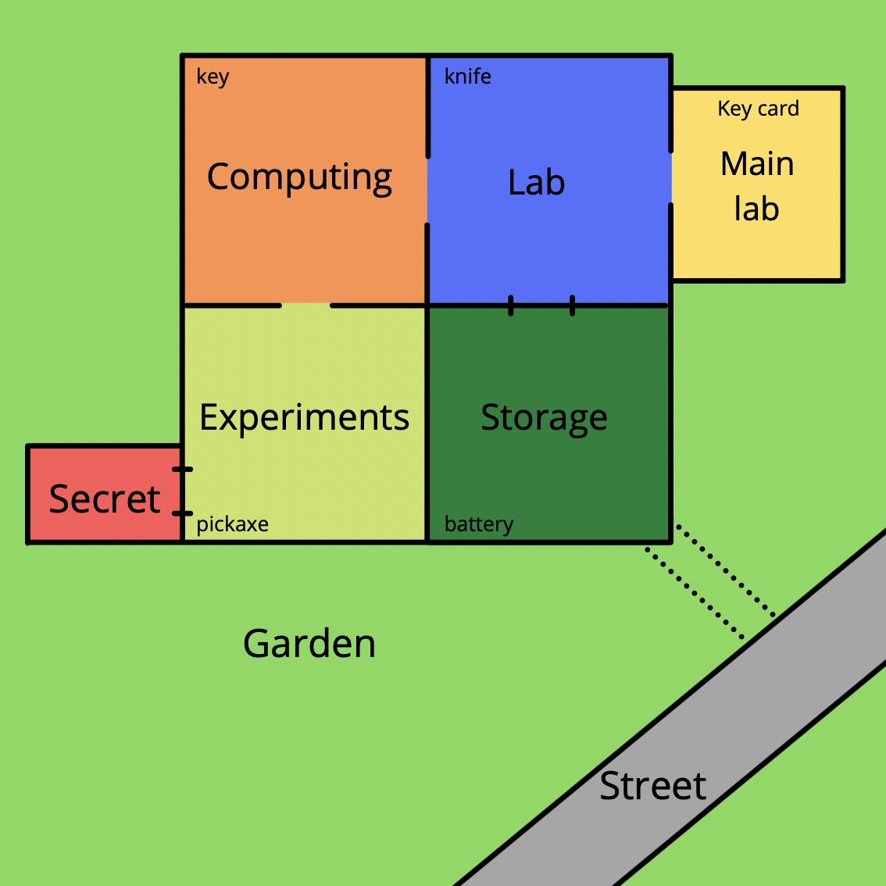

<h1 align="center">
    Simple ​Zork ​Game Assignment
</h1>

<p align="center">Rodrigo Samayoa Morales</p>
<p align="center">28/02/2022</p>
<p align="center">C++ Test</p>
<hr />

# About
I had to make a simple command line game based on Zork.
In my version, you wake up in an empty laboratory and you need to explore the different rooms to find a way out. You need to take all the objects that are on the different rooms and use them when you need them.

# How to play
Dependeing on the room you are, are the words that the game recognizes. You need to see the map of the laboratory to know how the rooms are conected, reading everything that appears on screen is a must for you to understand what is happening.

### Commands you can use

Take an object, for example:
You are on the lab and want to take the knife
```c++
take knife
```

Drop an object, for example:
You want to drop the key card
```c++
drop key card
```

Go to another room, for example:
You are on the lab room, and want to go to the computing room
```c++
go computing
```

To use and object, for example:
Use a key to open a door
```c++
use key
```

-If you want to know in what room you are:
```c++
room
```

-If you want to view your inventory:
```c++
inventory
```

You must consider that you can't jump between room. If you are in the lab, you can't go directly to experiments, you need to pass by computing.

Everything you type needs to be in lowercase, otherwise the game would not recognize it.

### Laboratory map


# Guide to finish the game
To finish the game you need to do a series of steps

1. You need to untie your self.
2. Take the key card.
3. Go to the computing room and the the key.
4. Go to the lab room and use the key to open the storage room door.
5. Enter the storage room and take the battery.
6. Go to the experiments room.
7. Use the key card to open the secret room door.
8. Enter the secret room and use the battery to charge the machine.
9. Use the machine to travel to another dimension.
10. Go to the storage room to unveil the hole on the wall.
11. Return to the secret room and use the machine to return to you dimension.
12. Go to the experiments room and take the pickaxe.
13. Go to the lab room and take the knife.
14. Enter the storage room and kill the wolf.
15. Use your pickaxe to open the hole.

Congrats, you finished the game (:

Gameplay link: https://www.youtube.com/watch?v=8ZH_iIZpuEo

# Compile and execute

### For Mac
Inside of the folder where you have all the files.
-To compile run:
```c++
g++ main.cpp world.cpp room.cpp item.cpp entity.cpp door.cpp creature.cpp player.cpp machine.cpp -o main
```
-To execute, run:
```c++
./main
```

### For Windows
Double click on the executable file.

# Github repository
https://github.com/sam17332/zorkTest

# Repository used as example
https://github.com/d0n3val/zork

# Author
Rodrigo Samayoa Morales
